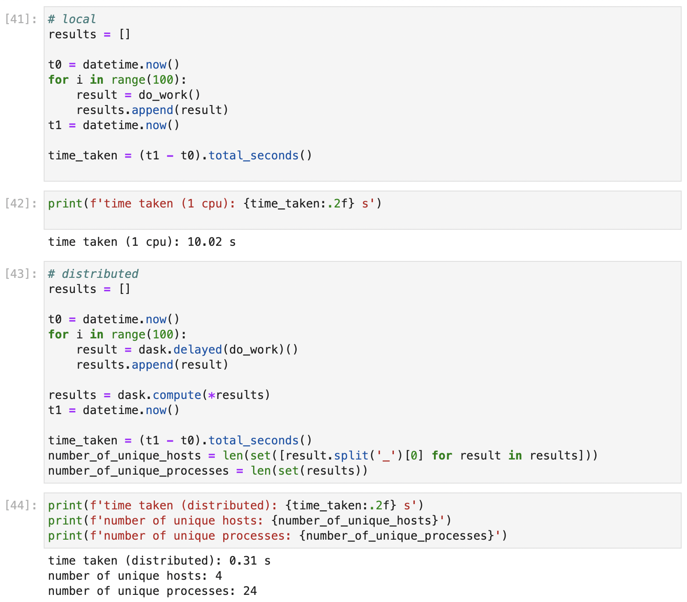

# Parallelise arbitrary work with Dask in a HPC environment

1. create an isolated environment e.g. `conda`
2. install `dask` and `dask-jobqueue` into python env
   `dask-jobqueue` provides cluster interface
3. ssh with port forwarding...
   8787 for dask
   8888 for jupyter server
   e.g. `ssh -N -L 8787:ui4.scarf.rl.ac.uk:8787 -L 8888:ui4.scarf.rl.ac.uk:8888 scarf1041@ui4.scarf.rl.ac.uk`
   
4. `jupyter server --generate-config` and `jupyter server password` to set up password for remote access
5. start `jupyter lab` on the remote server
6. connect to `localhost:8888` through browser on local machine for jupyter lab
7. setup cluster as in `scarf_cluster_creation.py`
8. connect to `localhost:8787` through browser on local machine for dask dashboard
9. run notebook `example.ipynb`

